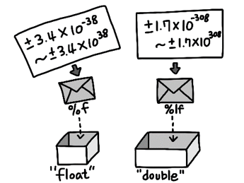

# 소소한 java

## 공백을 포함하여 `Scanner(System.in);` 하기

공백까지 포함하여 입력받고 싶을 땐 `nextLine()` 을 쓴다.

```java
Scanner sc = new Scanner(System.in);
String a = sc.nextLine();
```


## 온점(.)을 기준으로 spilt하기

그냥 `split(".");` 하면 안된다. 정규식에서 온점은 "불특정 문자 1개" 라는 의미라고 함.

해결 방법 : 

```java
spilt("\\.");
spilt("[.]");
```


## int의 범위를 넘어선 숫자 처리

자바는 `unsigned int`  가 없음. `unsigned` 는 `char` 형만 지원한다고 함

`long` 을 사용하면 됨

> 참고 : int의 범위는 -2147483648 ~ +2147483647


## #반올림

#### Math.round()

> 올림은 Math.ceil(); 
>
> 버림은 Math.floor();

```java
double pie = 3.14159265358979;
System.out.println(Math.round(pie)); //결과 : 3
System.out.println(Math.round(pie*100)/100.0); //결과 : 3.14
System.out.println(Math.round(pie*1000)/1000.0); //결과 : 3.142
```

#### String.format()

```java
double pie = 3.14159265358979;
double money = 4424.243423;
System.out.println(String.format("%.2f", pie)); //결과 : 3.14
System.out.println(String.format("%.3f", pie)); //결과 : 3.142
System.out.println(String.format("%,.3f", money)); //결과 : 4,424.243
```


## float 와 double

double은 float의 2배 이상의 실수 저장 가능




## 진수 변환 (Integer)

### From 10진수 to 2/8/16 진수

```java
int i = 127;
String binaryString = Integer.toBinaryString(i); //2진수
String octalString = Integer.toOctalString(i);   //8진수
String hexString = Integer.toHexString(i);       //16진수
```

### From 2/8/16진수 to 10진수

```java
// 8진수를 입력받아 10진수로 변환하는 예
String a = sc.next();
System.out.println(Integer.valueOf(a, 8));
```


## 대문자 <-> 소문자 변환

```java
hexString.toUpperCase();	// to 대문자
hexString.toLowerCase();	// to 소문자
```

