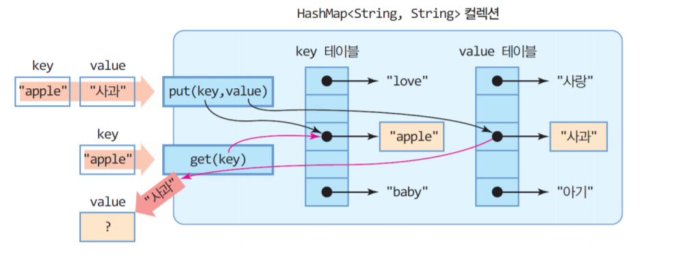

# HashMap에 대하여

자료 출처 : https://coding-factory.tistory.com/556

## HashMap이란?

Map 인터페이스를 구현한 대표적인 Map 컬렉션이다. Key와 Value로 구성된 Entry객체를 저장하는 구조를 갖고있는 자료구조이다. Value는 중복 저장될 수 있지만 Key는 중복 저장될 수 없다. Hashing을 사용하기 때문에 많은 양의 데이터를 검색하는 데 있어 뛰어난 성능을 보인다.



내부에 Key와 Value를 저장하는 자료구조를 갖고 있다. 해시함수를 통해 저장위치를 결정하므로 사용자는 그 위치를 알 수 없고, 삽임되는 순서와 들어있는 위치 또한 관계가 없다.

## HashMap 사용법

### 선언

```java
HashMap<String,String> map1 = new HashMap<String,String>(); //HashMap생성
HashMap<String,String> map2 = new HashMap<>(); //new에서 타입 파라미터 생략 가능
HashMap<String,String> map3	= new HashMap<>(map1); //map1의 모든 값을 가진 HashMap 생성
HashMap<String,String> map4 = new HashMap<>(10); //초기 용량capacity 지정
HashMap<String,String> map5 = new HashMap<>(10, 0.7f); //초기 capacity, load factor 지정
HashMap<String,String> map6 = new HashMap<String,String>(){{ //초기값 지정
	put("a","b");
}};
```

### 값 추가

```java
HashMap<Integer, String> map = new HashMap<>(); 
map.put(1, "apple");
map.put(2, "banana");
map.put(3, "grape");
System.out.println(map);
```

출력값 :

> {1=apple, 2=banana, 3=grape}

`put(key, value)` 메소드를 사용. HashMap 선언 시 설정해준 타입과 일치하는 Key와 Value를 넣어야 한다. 또한 입력되는 Key가 HashMap 내부에 존재할 경우 기존 값은 새로 입력되는 값으로 대치된다.

### 값 삭제

```java
map.remove(1); //key값 1 제거
System.out.println(map);
```

출력값 :

> {2=banana, 3=grape}

```java
map.clear(); //모든 값 제거
System.out.println(map);
```

출력값 :

> {}

### 값 출력

```java
HashMap<Integer, String> map = new HashMap<>(); 
map.put(1, "apple");
map.put(2, "banana");
map.put(5, "grape");
```

* 전체 출력

  ```java
  System.out.println(map);
  ```

  > {1=apple, 2=banana, 5=grape}

* key값으로 value 얻기

  ```java
  System.out.println(map.get(1));
  ```
  > apple

* entrySet()활용

  ```java
  for (Entry<Integer, String> entry : map.entrySet()) {
  			System.out.println("[Key]:"+ entry.getKey() + " [Value]:"+entry.getValue());
  }
  ```

  > [Key]:1 [Value]:apple
  >
  > [Key]:2 [Value]:banana
  >
  > [Key]:5 [Value]:grape

  `getKey()`,`getValue()` 로 key와 value 모두 출력할 수 있음

* KeySet() 활용

  ```java
  for(Integer i : map.keySet()) { //저장된 key값 확인
  			System.out.println("[key]:"+i+" [Value]:"+map.get(i));
  }
  ```

  > [key]:1 [Value]:apple
  >
  > [key]:2 [Value]:banana
  >
  > [key]:5 [Value]:grape

  key값만 받아서 사용.. `get(key)` 로 value도 출력할 수 있으나 value를 찾는 과정에서 시간이 많이 소모된다고 한다. 많은 양의 데이터를 가져올 때는 `entrySet()` 이 더 적합!

* Iterator

  1. entrySet().iterator()

  ```java
  Iterator<Entry<Integer, String>> entries = map.entrySet().iterator();
  while(entries.hasNext()) {
    Map.Entry<Integer, String> entry = entries.next();
  	System.out.println("[Key]:"+ entry.getKey() +" [Value]:"+ entry.getValue());
  }
  ```

  > [Key]:1 [Value]:apple
  >
  > [Key]:2 [Value]:banana
  >
  > [Key]:5 [Value]:grape

  2. keySet().iterator()

  ```java
  Iterator<Integer> keys = map.keySet().iterator();
  while(keys.hasNext()) {
  	int key = keys.next();
  	System.out.println("[key]:"+ key +" [Value]:"+ map.get(key));
  }
  ```

  > [key]:1 [Value]:apple
  >
  > [key]:2 [Value]:banana
  >
  > [key]:5 [Value]:grape

## ++

### getOrDefault

```java
default V getOrDefault(Object key, V defaultValue)
```

찾는 key가 존재하면 그 key의 value를 반환하고, 없으면 기본값을 반환


